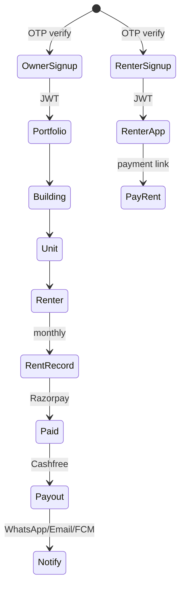
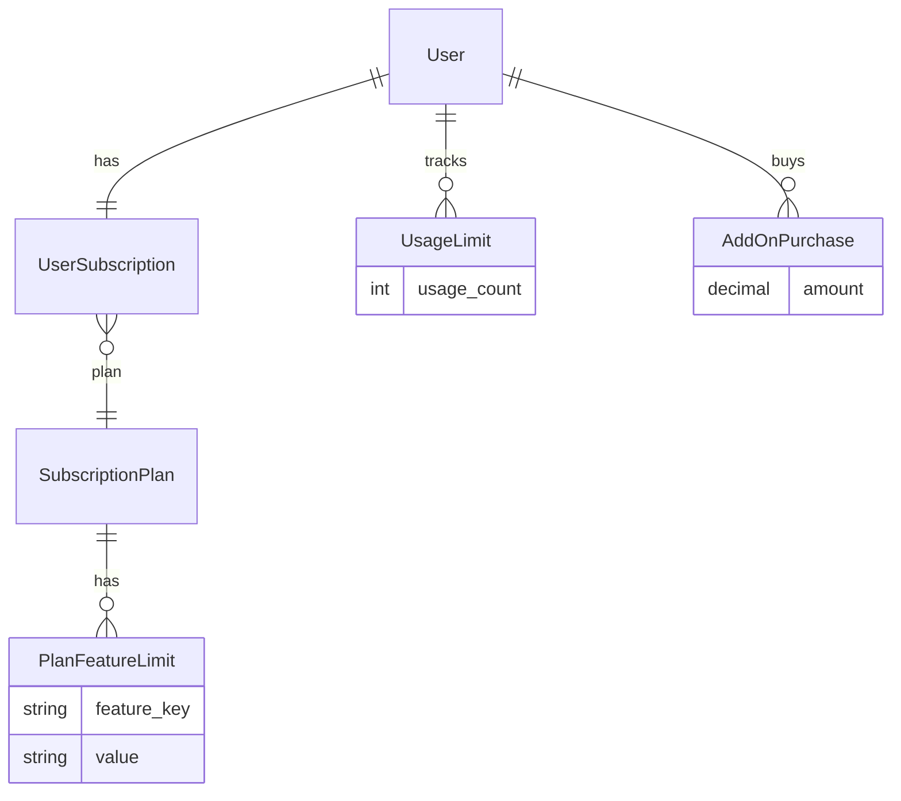
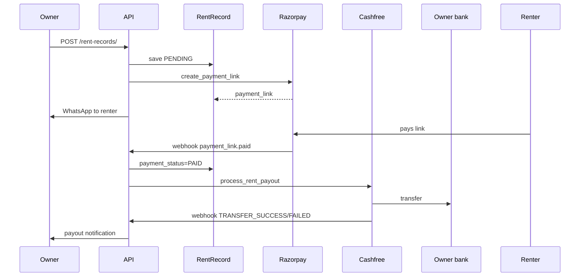

# RentSecureBE — Business Logic & Subscription (Deep Dive)

> **Per-domain rules:** See [business-rules/README.md](./business-rules/README.md) for separate files (buildings, renters, payments, etc.).

This document explains how the rental business logic and subscription system work in RentSecureBE: what the product does, how limits are enforced, how rent and payouts flow, and where design differs from what actually runs in code.

---

## 1. Product model (who does what)



| Actor | Auth | Primary APIs |
|--------|------|----------------|
| **Owner** | `POST /api/auth/send-otp/` → `owner/verify-otp/` | `/api/buildings/`, `/units/`, `/renters/`, `/rent-records/`, `/owner/dashboard-summary/` |
| **Renter** | same OTP → `renter/verify-otp/` | `/api/renter/rent-due/`, `/renter/rent-history/` |

Owners are scoped by **`request.user`** on every ViewSet (`unit.owner`, `building.owner`). Renters only see records linked to their `renter_profile`.

**Auth quirk:** `OwnerVerifyOTP` adds new owners to Django group `'tenant'` (`core/views.py`) — likely a copy-paste bug; role separation may rely on groups elsewhere.

---

## 2. Portfolio hierarchy & rules

Documented in `properties/business_rules.md` and enforced in serializers + views.

```
Owner
 └── Building (unique per owner: name + address_line + city)
      └── Unit (unique: unit + building + address_line; status vacant/occupied)
           ├── Caretaker (unique phone per unit)
           ├── Renter (unique phone per unit; statuses below)
           ├── UnitImage / UnitDocument (hash dedup in model clean)
           └── RentRecord (one per renter per rent_month)
```

### Renter lifecycle

| Status | Meaning |
|--------|---------|
| `active` | Paying tenant |
| `notice_period` | Leaving; still in owner list queries |
| `revoked` / `deactivated` | Ended; triggers archive/invoice signals **if signals were wired** |

Default owner API queryset only shows `active` and `notice_period` (`properties/views/renter_views.py`).

**Onboarding:** `send_renter_onboarding_invite()` sends a signed link via WhatsApp, sets `onboarding_status` → `link_sent`, then KYC (`not_started` → `verified`). Owner gets WhatsApp when KYC completes.

**Defaulters:** design is 3+ missed rents → `is_flagged`, notify owner (`properties/signals` + cron). **Signals are not registered** (see §7).

### Unit occupancy

`update_unit_status(unit)` sets `status` + `is_vacant` from active/notice_period renters — called after renter create/update/delete (`properties/services/unit_service.py`).

---

## 3. Subscription system (full mechanics)

### 3.1 Data layer



- **`PlanFeatureLimit.value`**: `"3"`, `"unlimited"`, or boolean-style `"yes"` / `"no"`.
- **`UsageLimit.usage_count`**: how many of that feature the user has “consumed” for limit checks.
- **`AddOnPurchase.amount`**: **summed as extra capacity** (not price), e.g. plan 10 + addon 5 → 15 buildings.

Models live in `core/models.py`: `SubscriptionPlan`, `UserSubscription`, `PlanFeatureLimit`, `UsageLimit`, `AddOnPurchase`.

### 3.2 `FeatureEnforcer` algorithm

Implementation: `properties/feature_enforcer.py`.

For feature key `K` (e.g. `max_buildings`):

1. **No `UserSubscription`** → limit = Free plan’s `PlanFeatureLimit` (or `0` if Free plan missing in DB).
2. **Has subscription, not expired** → `plan_limit + sum(addon amounts for K)`.
3. **Expired but within 7 days** (`GRACE_PERIOD_DAYS` in `properties/constants.py`) → still paid limits.
4. **Expired past grace** → Free plan limits again; **list** endpoints may **slice** queryset (e.g. first N buildings only).

**Create:** `can_create(K)` → `usage_count < limit` → on success `increment(K)`.

**Delete:** `decrement(K)`.

```python
def can_create(self, key):
    limit = self.get_active_limit(key)
    if limit == 'unlimited':
        return True
    current_usage = UsageLimit.objects.filter(user=self.user, feature_key=key).first()
    current_count = current_usage.usage_count if current_usage else 0
    return current_count < limit
```

### 3.3 Feature keys in use

| Key | Where enforced |
|-----|----------------|
| `max_buildings` | `BuildingViewSet` |
| `max_units` | `UnitViewSet` |
| `max_renters` | `RenterViewSet` (+ `check_feature_limit` in `create`) |
| `max_caretakers` | `CaretakerViewSet` |
| `max_unit_images`, `max_documents_uploads` | Unit image/doc ViewSets |
| `rent_agreement_drafts` | `RentAgreementDraftViewSet` |
| `rent_records` | `RentRecordViewSet` (not in model `FEATURE_CHOICES` — easy to misconfigure in admin) |

### 3.4 Second enforcement path (duplicate logic)

`RenterViewSet.create` runs **both**:

1. `check_feature_limit()` in `properties/utils` — uses `usersubscription` + `PlanFeatureLimit` only (no grace-period fallback).
2. `FeatureEnforcer.can_create()` in `perform_create`.

`enforce_limit()` in the same file **requires** an active `UserSubscription` or raises *“No active subscription found”* — stricter than `FeatureEnforcer`.

**Why tests fail without setup:** user has no subscription → `_get_plan_limit` returns `0` → `can_create` is false → **403**. Tests that pass explicitly create Free plan + `UserSubscription` + `PlanFeatureLimit` (see `properties/test_api_integration.py`).

### 3.5 Intended auto–Free plan (currently inactive)

`core/signals.py` creates `UserProfile`, `NotificationPreference`, and `UserSubscription(free)` on new `User` — but **`core/apps.py` never imports signals**:

```python
def ready(self):
    pass
```

So in a running app, **new OTP users do not get a subscription row** unless you create it manually or fix `ready()`.

### 3.6 Subscription APIs

| Endpoint | Access |
|----------|--------|
| `GET /api/subscription-plans/` | Public |
| `GET/POST /api/user-subscriptions/` | Owner JWT; scoped to self |
| `GET/POST /api/addon-purchases/` | Owner JWT |
| `GET /api/usage-limits/` | Read-only, own usage |

`seed_subscription_plans` and `downgrade_expired_users` management commands are **fully commented out** — production limits depend on **admin-seeded** `SubscriptionPlan` + `PlanFeatureLimit` rows.

### 3.7 Example: Free = 1 building

From integration tests (required DB state):

1. Create `SubscriptionPlan(name='free')`.
2. `PlanFeatureLimit(plan=free, feature_key='max_buildings', value='1')`.
3. `UserSubscription(user=owner, plan=free, end_date=future)`.
4. First `POST /api/buildings/` → **201**; second → **403**.

Without steps 2–3, the first building also gets **403**.

---

## 4. Rent & money flow (end-to-end)



### 4.1 Creating a rent record

`RentRecordViewSet.perform_create` (`properties/views/rent_record_views.py`):

1. Validates owner owns unit; renter on unit; no duplicate `rent_month`.
2. Checks `FeatureEnforcer.can_create("rent_records")`.
3. Saves record with `owner=user`.
4. Calls `create_payment_link(rent)` → stores `payment_link`, WhatsApp to renter.
5. `increment("rent_records")`.

`RentRecord` exposes compatibility properties for payment code (`properties/models/rent_record_models.py`):

```python
@property
def amount(self):
    return self.amount_paid

@property
def month(self):
    return self.rent_month.month
```

### 4.2 Razorpay webhook (important)

`core/views.py` defines **`razorpay_webhook` three times**; Python keeps only the **last** definition:

- First version: HMAC signature verify + `payment.captured` + `razorpay_order_id`.
- **Active version:** no signature check; handles `payment_link.paid` and looks up rent by `reference_id`.

Payment links from `rentsecure_be/services/razorpay_service.py` do not set `reference_id` to `rent.id` in the create payload — webhook matching may fail unless the frontend/Razorpay config aligns.

### 4.3 Payout

On `PAID`, `process_rent_payout(rent)` (`rentsecure_be/services/cashfree_service.py`):

1. Loads `OwnerBankDetails` for owner.
2. Requires `beneficiary_id` (Cashfree registration via `update_owner_bank_details`).
3. `make_payout(transfer_id=rent_{id}, amount=rent.amount, ...)`.
4. Sets `payout_status` SUCCESS/FAILED; notifies via `send_payout_notification`.

**Retry:** `POST /api/owner/retry_payout_api/<rent_id>/` only if `payment_status == PAID` and `payout_status == FAILED`.

**Cashfree webhook:** updates payout from `transferId` → `payout_reference` (`core/views.py` → `cashfree_payout_webhook`).

Several payout paths reference `rent.renter.property.owner` — the model uses **`unit`**, not `property` (runtime risk on those branches).

### 4.4 After payment (designed side effects)

`properties/signals/__init__.py` on `RentRecord` save when `PAID`:

- Cancel scheduled reminder job
- Thank-you voice note (`notification/services/voice_service.py` → gTTS MP3)
- In-app notification to renter
- Email receipt via `receipt_service`

**These receivers are never loaded** because `properties/apps.py` does not import signals (same as core).

### 4.5 Owner dashboard

`GET /api/owner/dashboard-summary/` (`properties/views/owner_dashboard.py`) aggregates:

- Total / this-month collected (`amount_paid`, `PAID`)
- Payout counts by status
- 6-month trend (`TruncMonth` on `rent_month`)
- Defaulters: `PENDING` or legacy `"UNPAID"` with `rent_due_date < today`

Uses `rent.due_date` property (alias for `rent_due_date`) in defaulter payload.

### 4.6 Late fees

`apply_late_fee_if_needed()` in `properties/utils`: if paid after `rent_due_date`, adds ₹100/day to `late_fee`, rolls reason into next month’s record, notifies owner/renter — must be called from a job or view (not automatic on every save).

---

## 5. Caching layer

Per-user queryset caching (5 min) for buildings, units, renters, rent records, etc. Keys like `buildings_user_{id}`.

Invalidated on create/update/delete for that resource. **Stale risk:** if data changes outside ViewSets (admin, broken signals), cache can lie until TTL.

Timeouts: `properties/constants.py` (`BUILDINGS_CACHE_TIMEOUT`, etc.).

---

## 6. Notifications & automation (intended)

| Job / module | Purpose | Status |
|--------------|---------|--------|
| `generate_monthly_rent_records` | Bulk create monthly rows | Broken import (`rent.models`) |
| `daily_rent_reminder` | 3d before / due / 2d late | Broken import (`rent.models`) |
| `downgrade_expired_users` | Trim resources after grace | Commented out |
| Celery beat + `properties/scheduler` | Per-rent reminders | Partially wired |
| SmartBot intents | reminder, retry payout, agreement | Keyword routing in `smartbot/intents.py` |

Rent reminders in `UserSubscription`: `rent_reminder_days_before` (default 7) — used by notification services when those run.

---

## 7. Design vs reality (critical gaps)

| Designed behavior | Actual state |
|-------------------|--------------|
| New user gets Free `UserSubscription` | Signal exists; **not connected** in `AppConfig.ready()` |
| Usage sync on model save | `properties/signals` **not imported** |
| Receipt / voice note on PAID | Same — only if something imports signals |
| Seed plans on deploy | Command **commented out** |
| Downgrade after expiry | Command **commented out** |
| Secure Razorpay webhook | Overwritten by unsigned handler |
| Owner group on signup | Assigned `'tenant'` group |
| `rent_records` plan limit | Used in code; not in `AddOnPurchase.FEATURE_CHOICES` |

**Practical implication:** subscription limits work **only if** you seed plans/limits in DB and often create `UserSubscription` manually; many “automation” paths are code-only until signals/commands are wired.

---

## 8. How to think about “is this user allowed?”

Decision tree for **creating a building**:

```
JWT valid?
  └─ No → 401
  └─ Yes → FeatureEnforcer.can_create('max_buildings')?
        └─ No UserSubscription → free plan limit from DB (0 if missing)
        └─ Expired > 7 days → free limit
        └─ Else → plan limit + addons
        usage_count < limit?
          └─ No → 403
          └─ Yes → create, increment, clear cache
```

For **renters**, you also get a structured 403 from `check_feature_limit` with `required_add_on`, `subscription_limit`, `current_usage` — good for upsell UI.

---

## 9. Minimal dev setup for subscription to work

```python
# Django shell after migrate
from core.models import SubscriptionPlan, PlanFeatureLimit, UserSubscription
from django.contrib.auth import get_user_model
User = get_user_model()

free, _ = SubscriptionPlan.objects.get_or_create(
    name='free',
    defaults={'monthly_price': 0, 'yearly_price': 0, 'is_active': True},
)
for key, val in [
    ('max_buildings', '1'),
    ('max_units', '3'),
    ('max_renters', '5'),
    ('max_caretakers', '2'),
    ('rent_records', 'unlimited'),
]:
    PlanFeatureLimit.objects.get_or_create(
        plan=free, feature_key=key, defaults={'value': val}
    )

u = User.objects.get(phone='...')
UserSubscription.objects.get_or_create(user=u, defaults={'plan': free})
```

Wire signals in `core/apps.py` and `properties/apps.py`:

```python
def ready(self):
    import core.signals  # noqa: F401
```

```python
def ready(self):
    import properties.signals  # noqa: F401
```

---

## 10. Related files

| Topic | Path |
|--------|------|
| Business rules (CRUD) | `properties/business_rules.md` |
| Feature enforcement | `properties/feature_enforcer.py` |
| Subscription models | `core/models.py` |
| Auth & webhooks | `core/views.py`, `core/urls.py` |
| Property APIs | `properties/urls.py`, `properties/views/` |
| Signals (unwired) | `core/signals.py`, `properties/signals/__init__.py` |
| Razorpay / Cashfree | `rentsecure_be/services/razorpay_service.py`, `cashfree_service.py` |
| Project overview | `README.md` |

---

## 11. Summary

**Business logic:** Indian rental SaaS — owners manage properties and rent; renters pay via Razorpay; owners receive Cashfree payouts; WhatsApp-heavy comms; KYC/agreements/defaulter handling on top.

**Subscription:** Freemium caps via `PlanFeatureLimit` + `UsageLimit` + optional add-ons, with 7-day grace after `end_date`. Enforcement is real in ViewSets but **fragile** without DB seeding, with **duplicate helpers** and **disconnected signals**.

**Recommended fixes (highest impact):**

1. Wire `signals` in `core/apps.py` and `properties/apps.py`.
2. Fix `python-decouple` pin in `requirements.txt` (use `3.8`, not `3.9`).
3. Deduplicate `razorpay_webhook` and align payment link `reference_id` with rent id.
4. Seed default Free plan + `PlanFeatureLimit` on deploy or via management command.
