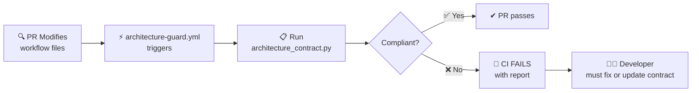

# Architecture Contract

> **Version:** 2.0.0
> **Purpose:** Enforce the approved CI/CD pipeline architecture as a machine-verifiable contract.
> **File:** `scripts/architecture_contract.py`
> **Workflow:** `.github/workflows/architecture-guard.yml`

---

## What is the Architecture Contract?

The **Architecture Contract** is a formal, versioned specification of the RentSecureBE CI/CD pipeline. Instead of merely documenting the pipeline in a diagram, this contract makes the pipeline structure **machine-enforceable**.

The contract defines:

1. **Required Jobs** — Every job that must exist in `ci.yml`
2. **Required Workflow Files** — Every workflow file that must exist on disk
3. **Dependency Chains** — Every job's `needs:` constraints (the stage ordering)
4. **Bypass Protections** — Critical paths (security, quality gate, deploy readiness) that cannot be skipped
5. **Deploy Restrictions** — The deploy job must be restricted to `push` events only

---

## Contract Enforcement Flow



---

## The Contract (Source of Truth)

### Required Jobs

Every one of these jobs **must** appear in `.github/workflows/ci.yml`:

| Job | Stage | Purpose |
|-----|-------|---------|
| `lint` | 1-2 | Setup & Code Quality |
| `test` | 3a | Pytest + Coverage |
| `hypothesis` | 3b | Hypothesis Property Tests |
| `contract-tests` | 3c | API Contract Tests |
| `mutation` | 3d | Mutation Testing |
| `performance` | 3e | Performance & Load Tests |
| `django-check` | 4 | Django System & Migration Checks |
| `architecture` | 5 | Architecture & Contracts |
| `security` | 6 | Security & Supply Chain |
| `quality` | 7 | Quality Gate (SonarCloud) |
| `deploy-readiness` | 8a | Deploy Readiness Check |
| `deploy` | 8b | Deploy to Production |

### Required Workflow Files

Every one of these files **must** exist in `.github/workflows/`:

- `ci.yml`
- `lint.yml`
- `test.yml`
- `django-check.yml`
- `hypothesis.yml`
- `contract-tests.yml`
- `architecture.yml`
- `security.yml`
- `quality.yml`
- `performance.yml`
- `mutation.yml`
- `deploy-readiness.yml`
- `deploy.yml`

### Approved Dependency Chain

| Job | Must Depend On |
|-----|----------------|
| `lint` | *(none — root job)* |
| `test` | `lint` |
| `hypothesis` | `lint` |
| `contract-tests` | `lint` |
| `mutation` | `lint` |
| `performance` | `lint` |
| `django-check` | `lint` |
| `architecture` | `django-check` |
| `security` | `architecture` |
| `quality` | `test`, `contract-tests` |
| `deploy-readiness` | `security`, `quality`, `performance`, `mutation` |
| `deploy` | `deploy-readiness` |

### Protected Paths (Cannot Be Bypassed)

| Path | Protected By | Risk If Bypassed |
|------|-------------|------------------|
| Security | `security` must depend on `architecture` | Vulnerabilities deployed to production |
| Quality Gate | `quality` must depend on `test` + `contract-tests` | Low-quality code merged |
| Deploy Readiness | `deploy-readiness` must depend on `security`, `quality`, `performance`, `mutation` | Broken deployments |
| Deploy Trigger | `deploy` must be restricted to push events | Accidental deployment from PR |

---

## What Gets Checked

| # | Check | Severity | Fail Condition |
|---|-------|----------|----------------|
| 1 | Required workflow files exist | `ERROR` | A required `.yml` file is missing |
| 2 | Required jobs present | `ERROR` | A required job is missing from `ci.yml` |
| 3 | Extra jobs | `WARNING` | Unrecognized jobs found (advisory) |
| 4 | Dependency exact match | `ERROR` | A job's `needs:` list changed |
| 5 | Stage ordering | `ERROR` | Transitive dependency is missing |
| 6 | Security bypass | `CRITICAL` | `security` job dependency altered |
| 7 | Quality gate bypass | `CRITICAL` | `quality` job dependency altered |
| 8 | Deploy readiness bypass | `CRITICAL` | `deploy-readiness` dependency altered |
| 9 | Deploy on PR | `ERROR` | Deploy not restricted to push events |

---

## How to Modify the Contract

If you need to change the CI pipeline architecture:

```bash
# 1. Update the contract constants in
vim scripts/architecture_contract.py

# 2. Update this documentation
vim docs/architecture-contract.md

# 3. Run the validator to verify
python scripts/architecture_contract.py --verbose

# 4. Run the tests
python -m pytest tests/test_architecture_contract/ -v

# 5. Submit for architecture review
#    Any contract change requires senior engineer approval.
```

### Modification Checklist

- [ ] Updated `REQUIRED_JOBS` in `architecture_contract.py`
- [ ] Updated `REQUIRED_WORKFLOW_FILES` in `architecture_contract.py`
- [ ] Updated `APPROVED_DEPENDENCY_CHAIN` in `architecture_contract.py`
- [ ] Updated the stage ordering expectations
- [ ] Updated this documentation
- [ ] Added/updated tests in `tests/test_architecture_contract/`
- [ ] Ran `python scripts/architecture_contract.py --verbose` → ✅ COMPLIANT
- [ ] Ran `python -m pytest tests/test_architecture_contract/ -v` → all pass
- [ ] Got architecture review approval

---

## Example: Breaking the Contract

### What happens if you remove a required job?

1. A developer removes the `mutation` job from `ci.yml`
2. The `architecture-guard.yml` workflow triggers on the PR
3. `architecture_contract.py` detects the violation:

```
🔴 [ERROR] Required job 'mutation' is missing from ci.yml
```

4. CI fails with a detailed report
5. The developer must either add the job back or get approval to update the contract

### What happens if you bypass security?

1. A developer changes `security`'s dependencies to `[]`
2. The guard detects:

```
🔴 [CRITICAL] SECURITY BYPASS: The 'security' job has no dependencies.
```

3. CI fails immediately — security bypass is never allowed

---

## Running Locally

```bash
# Basic check
python scripts/architecture_contract.py

# Verbose with full report
python scripts/architecture_contract.py --verbose

# JSON output for programmatic consumption
python scripts/architecture_contract.py --json > report.json

# Strict mode (warnings also fail)
python scripts/architecture_contract.py --strict

# Run tests
python -m pytest tests/test_architecture_contract/ -v
```

---

*This contract is enforced automatically on every PR that modifies `.github/workflows/` or the contract validator itself.*
