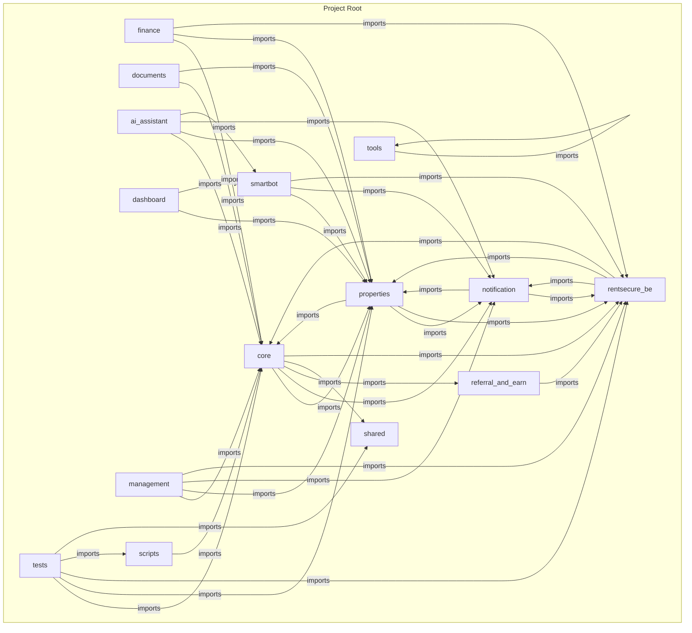
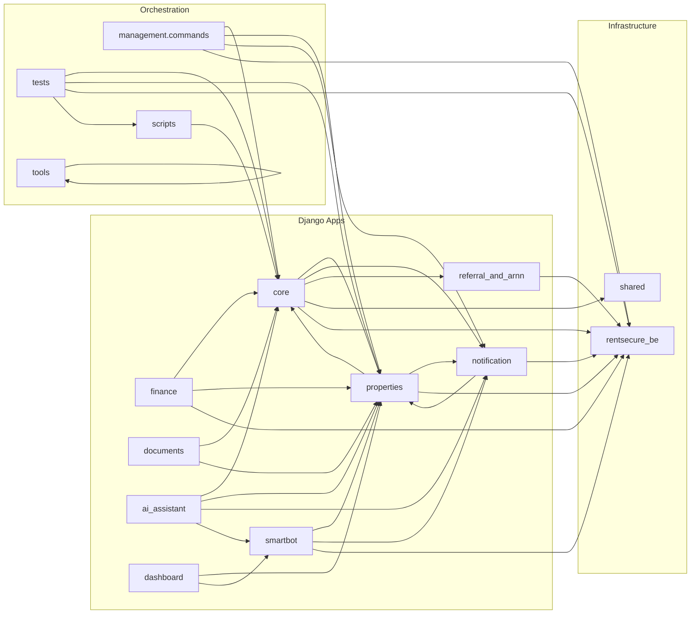
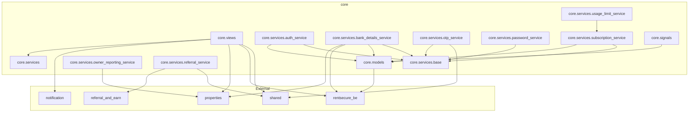
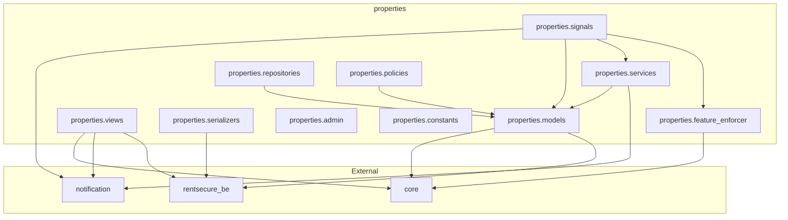
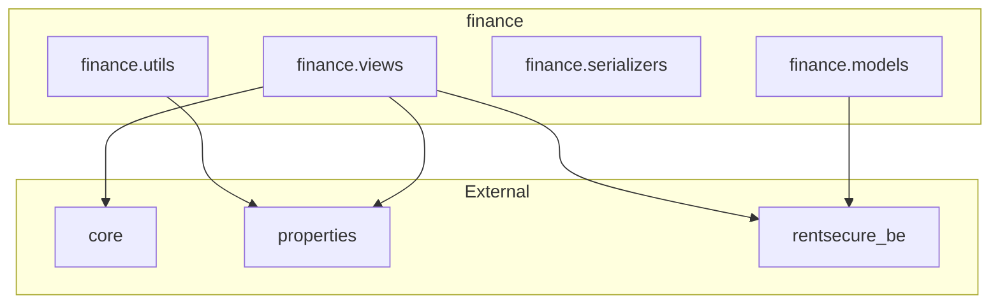

# 01 Dependency Graph

## Package Dependency Graph



**Evidence:** Derived from AST analysis of 340 Python files. Cross-app imports: 205.

## App Dependency Graph (Simplified)

```
core
├── properties
├── notification
├── referral_and_earn
├── shared
└── rentsecure_be

properties
├── core
├── notification
└── rentsecure_be

smartbot
├── properties
├── notification
└── rentsecure_be

finance
├── core
├── properties
└── rentsecure_be

notification
├── properties
└── rentsecure_be

documents
├── core
└── properties

ai_assistant
├── properties
├── core
├── notification
└── smartbot

dashboard
├── properties
└── smartbot
```

## Module Dependency Graph (Top-Level)

| Module | Imports From | Imported By |
|--------|-------------|-------------|
| `properties.models` | - | 74 modules |
| `core.models` | `rentsecure_be.type_compat` | 63 modules |
| `rentsecure_be.type_compat` | stdlib | 36 modules |
| `notification.services.whatsapp_service` | stdlib, twilio, boto3 | 21 modules |
| `core.views` | core.services, notification.services, properties.models, rentsecure_be | 3 modules |
| `properties.signals` | notification.models, notification.services, properties.models, properties.scheduler, properties.services, properties.utils | 3 modules |
| `rentsecure_be.services.cashfree_service` | core.models, notification.services, properties.models, rentsecure_be.utils | 6 modules |
| `properties.utils.utils` | core.models, notification.services, properties.models, properties.feature_enforcer | 3 modules |
| `notification.utils` | stdlib | 6 modules |
| `notification.models` | django | 6 modules |

## High-Level Architecture Diagram



## Core Dependency Graph



## Properties Dependency Graph



## Notification Dependency Graph

```mermaid
graph TD
    subgraph "notification"
        NM[notification.models]
        NV[notification.views]
        NS[notification.services]
        NS_WA[notification.services.whatsapp_service]
        NS_SMS[notification.services.sms_service]
        NS_VOICE[notification.services.voice_service]
        NS_VN[notification.services.voice_note_service]
        NS_COMM[notification.services.communication]
        NS_NOTIF[notification.services.notifications]
        NS_RENT[notification.services.rent_notify_service]
        NS_EC[notification.services.extra_charge_reminders]
        NS_SCHED[notification.services.schedule_reminders]
        NS_LATE[notification.services.late_fees_notify_service]
        NUTIL[notification.utils]
    end

    subgraph "External"
        PROPS[properties]
        RBE[rentsecure_be]
    end

    NS_WA --> PROPS
    NS_WA --> RBE
    NS_VN --> PROPS
    NS_VN --> NS_VOICE
    NS_VN --> NS_WA
    NS_RENT --> NS_VOICE
    NS_RENT --> NS_WA
    NS_RENT --> RBE
    NS_EC --> PROPS
    NS_EC --> NS_VOICE
    NS_EC --> NS_WA
    NS_EC --> RBE
    NS_SCHED --> PROPS
    NS_SCHED --> NS_VOICE
    NS_SCHED --> NS_WA
    NS_LATE --> NS_WA
    NS_COMM --> NS_NOTIF
    NS_COMM --> NS_SMS
    NS_COMM --> NS_WA
```



## Finance Dependency Graph



## Evidence Notes

- All diagrams are derived from `docs/architecture/audit_data.json` (AST-based analysis).
- Cross-app import count: 205
- Total modules analyzed: 321
- Total imports: 387
- Source: `scripts/arch_audit.py` (AST-based static analysis)
