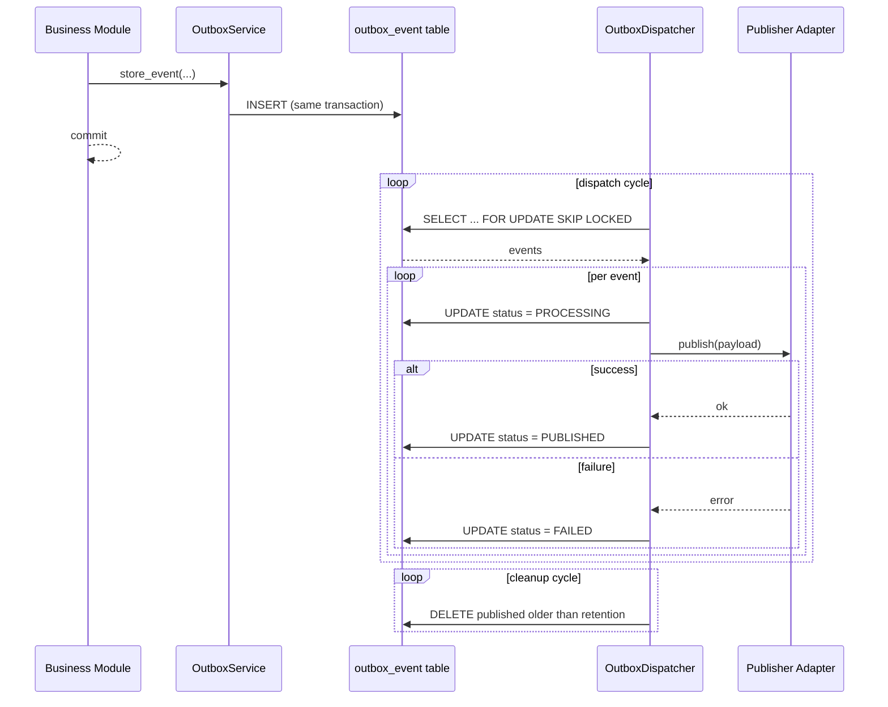

# Transactional Outbox Pattern

**Phase:** Phase 2.2 — Transactional Outbox Pattern
**Status:** Implemented
**Date:** 2026-07-22

## Purpose

The Transactional Outbox Pattern guarantees reliable event delivery between business modules and asynchronous transport backends (Celery, Kafka, SQS, RabbitMQ).

It decouples event creation from event publication. Business modules persist events to an `outbox_event` table in the same database transaction as their business state changes. A dispatcher process publishes the events asynchronously, ensuring no events are lost even if the publisher is temporarily unavailable.

## Architecture

```
business module
     |
     | store_event() / store_events()
     v
 outbox_event table (PostgreSQL)
     |
     | dispatch()
     v
 OutboxDispatcher
     |
     | publisher(payload)
     v
 Publisher interface -> adapter (Celery / Kafka / SQS / RabbitMQ)
```

## Lifecycle

1. Business module calls `OutboxService.store_event()` or `store_events()`.
2. An `OutboxEvent` row is created in the same DB transaction as the business data change.
3. The dispatcher loads pending events (`PENDING` or retryable `FAILED`).
4. For each event:
   a. Status is set to `PROCESSING`.
   b. Event payload is passed to the configured publisher.
   c. On success: status becomes `PUBLISHED` and `published_at` is set.
   d. On failure: retry count is incremented and `next_retry_at` is computed.
   e. If retries are exhausted: status becomes `DEAD_LETTER`.
5. A cleanup process removes `PUBLISHED` events older than the retention period.

## Sequence Diagram



## Retry Flow

| Attempt | Backoff |
|---------|---------|
| 1 | 1 minute |
| 2 | 2 minutes |
| 3 | 4 minutes |
| 4 | 8 minutes |
| 5 | 16 minutes |
| 6 | 32 minutes |

- Formula: `min(60 * (2 ** (retry_count - 1)), 32 * 60)` seconds.
- Default maximum retries: 6.
- Configure via `OUTBOX_MAX_RETRY`.

## Cleanup Flow

- Deletes only `PUBLISHED` events older than `OUTBOX_RETENTION_DAYS` (default 30).
- Never removes `PENDING`, `PROCESSING`, `FAILED`, or `DEAD_LETTER` events.
- Run via management command:

```bash
python manage.py cleanup_outbox
```

## Operational Runbook

1. **Monitoring dashboards:**
   - `PENDING` count rising → dispatcher is lagging or publisher is down.
   - `DEAD_LETTER` count rising → investigate and re-process manually.
2. **Re-processing dead letters:**
   - Inspect `DEAD_LETTER` events via Django Admin (`/admin`).
   - Reset events manually or run a script that updates their status to `PENDING`.
3. **Rate limiting:**
   - Tune `OUTBOX_BATCH_SIZE` to control burst load.
   - Tune `OUTBOX_DISPATCH_INTERVAL` if running in a loop.

## Monitoring Recommendations

- Alert when `PENDING` count exceeds threshold for > 5 minutes.
- Alert when `DEAD_LETTER` count exceeds 0 for > 30 minutes.
- Track dispatch throughput (events / sec) and latency (time in `PENDING`).
- Log every publish success/failure with `event_id`, `aggregate_type`, and error detail.

## Future Integration Points

### Celery
Replace the synchronous `dispatch()` loop with a Celery task bounded by the same repository and service contracts.

```python
from celery import shared_task
from core.events.outbox.dispatcher import OutboxDispatcher

@shared_task
def dispatch_outbox_events() -> None:
    OutboxDispatcher(publisher=publish_event).dispatch()
```

Trigger periodically via Celery Beat with `OUTBOX_DISPATCH_INTERVAL`.

### Kafka
Implement a `payloads.KafkaPublisher` adapter and inject it into `OutboxDispatcher`. No changes to `OutboxService` or `OutboxEventRepository` are required.

### Amazon SQS
Implement an `SQSAdapter` and use `OutboxDispatcher` the same way. For high-throughput use-cases, replace `get_pending()` with a SQS-backed pull query, again without touching business modules.

## Configuration

| Variable | Default | Description |
|----------|---------|-------------|
| `OUTBOX_BATCH_SIZE` | 100 | Max events per dispatch cycle |
| `OUTBOX_MAX_RETRY` | 6 | Max retry attempts before dead-letter |
| `OUTBOX_RETENTION_DAYS` | 30 | Age (in days) before published events are deleted |
| `OUTBOX_DISPATCH_INTERVAL` | 60 | Seconds between dispatch cycles |

Access configuration through `core.config.settings`:

```python
from core.config.settings import (
    get_outbox_batch_size,
    get_outbox_max_retry,
    get_outbox_retention_days,
    get_outbox_dispatch_interval,
)
```

## Design Decisions

1. `OutboxEvent` lives under the existing `core` app (`app_label = "core"`) to preserve backward compatibility and avoid architectural redesign.
2. No business module imports the dispatcher directly. Events are stored only; publishing is deferred.
3. `select_for_update(skip_locked=True)` prevents concurrent dispatchers from double-processing events.
4. `save_many()` uses `bulk_create` for performance when ingesting large event batches.
5. Dead-letter events are never auto-deleted, enabling operational investigation and replay.
