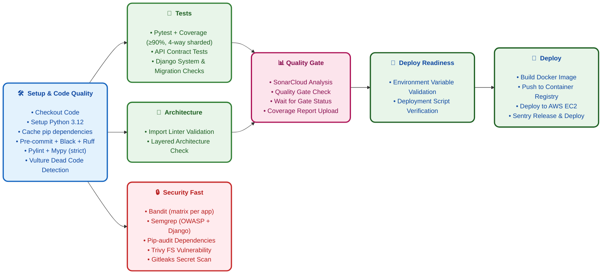
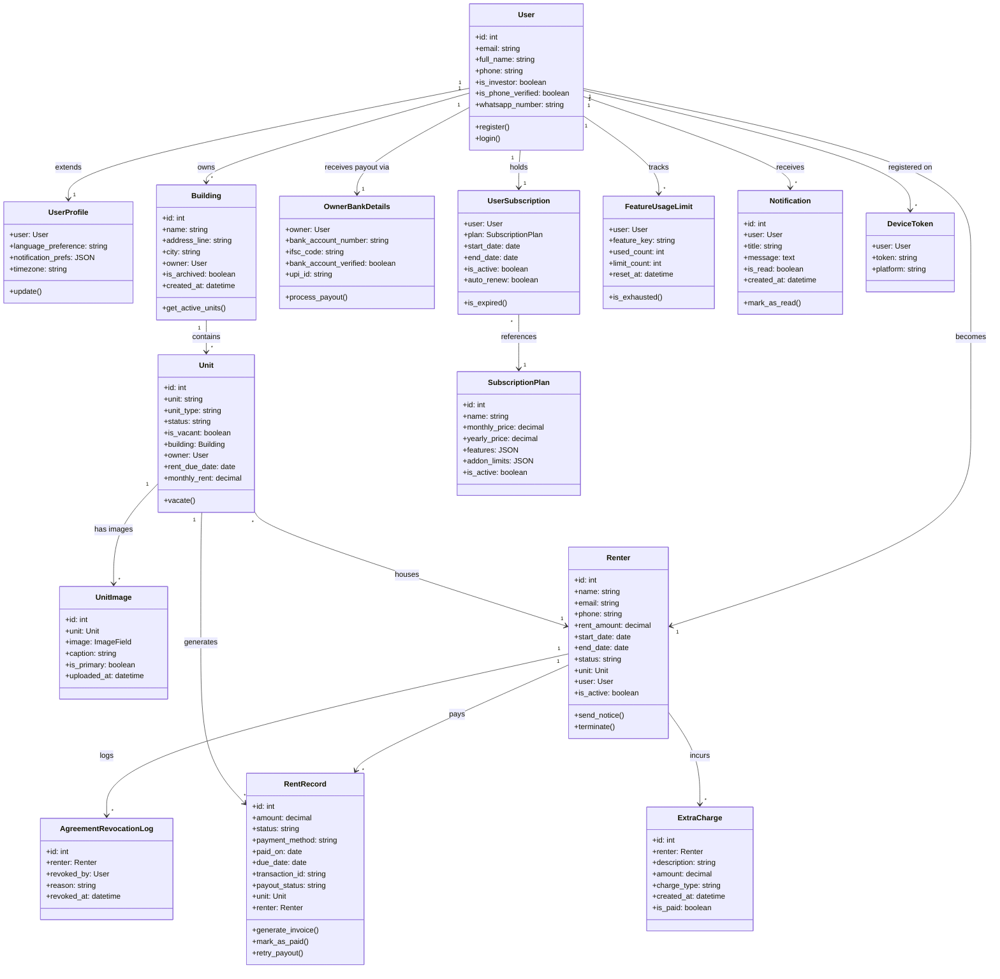
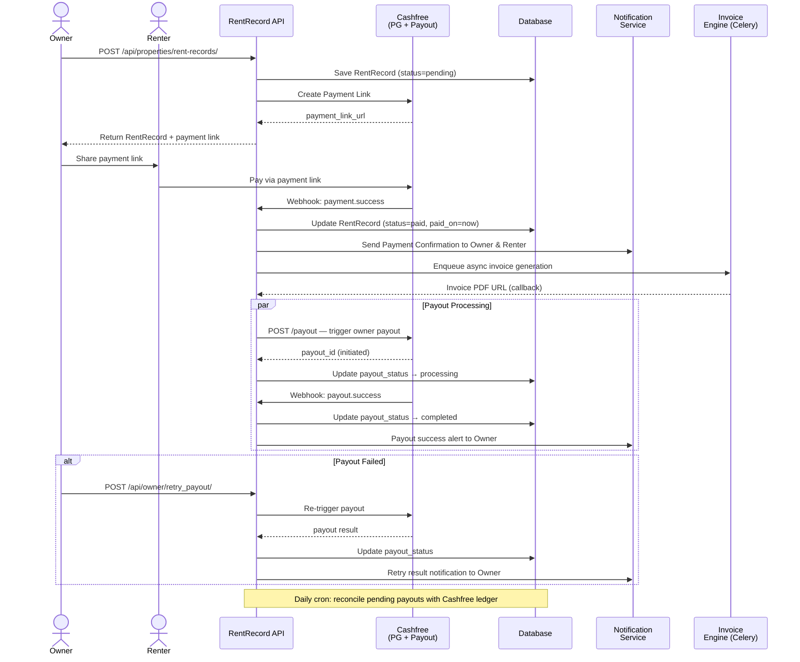
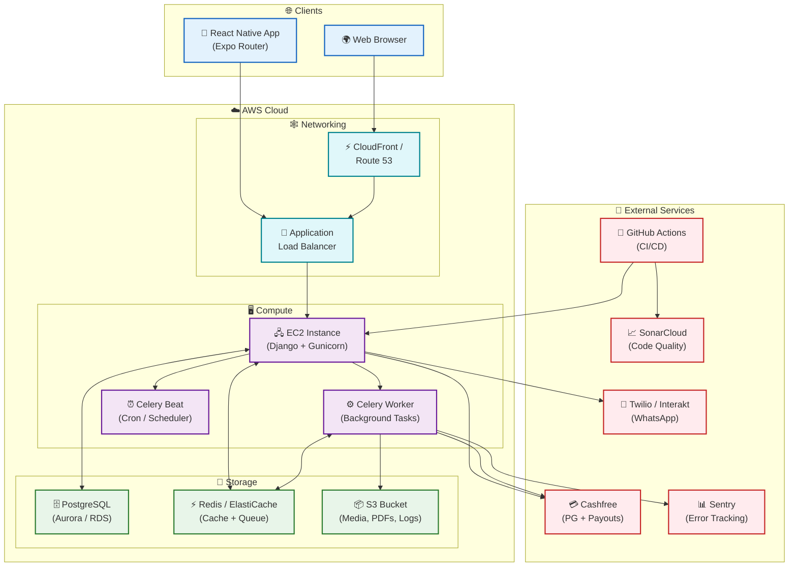

# CI/CD Pipeline & UML Overview

> **Project:** RentSecureBE — Production-Grade Django Backend
> **Stack:** Django 5.2 / DRF / PostgreSQL / AWS EC2 / Cashfree
> **Pipeline Version:** 2.3.0

---

## Part 1: CI/CD Pipeline Flow Diagram



### Pipeline Summary (from `.github/workflows/ci.yml`)

| # | Stage | Key Jobs | Runtime Source |
|---|-------|----------|----------------|
| 1 | **Setup & Code Quality** | `pre-commit, black, ruff, pylint, mypy, vulture` | Measured by CI Metrics (`ci-metrics.yml`) |
| 2 | **Tests** | `pytest + coverage (4-way sharded)`, `API contract tests`, `Django checks` | Measured by CI Metrics |
| 3 | **Architecture** | `import-linter` | Measured by CI Metrics |
| 4 | **Security Fast** | `bandit (matrix)`, `semgrep`, `pip-audit`, `trivy`, `gitleaks`, `dependency-review` | Measured by CI Metrics |
| 5 | **Quality Gate** | `sonarcloud` analysis + quality gate wait | Measured by CI Metrics |
| 6 | **Deploy Readiness** | `env validation`, `script verification` | Measured by CI Metrics |
| 7 | **Deploy** | `deploy.yml`: EC2 SSH, Docker, Sentry release | Measured by CI Metrics |

> **Note:** Runtimes are collected automatically via `.github/workflows/ci-metrics.yml` using the GitHub Actions API (last 30 successful runs). PR pipeline target is ≤15 minutes. Deep validation (hypothesis, mutation, load testing, codeql, scorecard, SBOM scanning) runs nightly/weekly.

---

### Optional Enhancements

| Enhancement | Description |
|-------------|-------------|
| ⚡ **Parallel Job Execution** | Lint, Security, and Test workflows run concurrently to reduce total wall-clock time. |
| 🐍 **Matrix Testing** | Python 3.12 (standardized runtime). |
| 💾 **Aggressive Caching** | pip cache (`~/.cache/pip`) and pre-commit cache (`~/.cache/pre-commit`) cut CI time by ~40%. |
| 📦 **Build Artifacts** | Coverage reports, Locust HTML reports, and mutmut results persist as downloadable artifacts. |
| 🔔 **Notifications** | Slack / Email alerts on pipeline failure, deploy success, or quality gate breach. |
| 🛡️ **Environment Protection** | Require manual approval before deploying to production. |
| ✅ **Manual Approval Gate** | Production deploy gates enforce a designated approver sign-off. |
| 📈 **Performance Regression Check** | Automated benchmark comparison against last-known-good run. |

---

## Part 2: What is UML?

<div style="border: 2px solid #1565C0; border-radius: 12px; padding: 20px; background: #F8F9FA;">

**UML (Unified Modeling Language)** is a standardized visual modeling language used in software engineering to specify, visualize, construct, and document the artifacts of a software system. It helps developers, architects, and stakeholders understand the system's structure, behavior, and deployment through a rich set of diagram types.

**Why we use it:**
- 📌 **Communicate architecture** across technical and non-technical teams
- 📌 **Document design decisions** before implementation
- 📌 **Verify consistency** between code and design
- 📌 **Onboard new engineers** faster with visual context

</div>

---

## Part 3: Types of UML Diagrams

| # | Diagram Type | Purpose |
|---|--------------|---------|
| 1 | **Use Case Diagram** | Captures system functionality from an end-user perspective — shows actors, use cases, and boundaries. |
| 2 | **Class Diagram** | Models the static structure: classes, attributes, methods, and relationships (inheritance, associations, dependencies). |
| 3 | **Sequence Diagram** | Shows object interactions arranged in time sequence — message flow between actors and system components. |
| 4 | **Activity Diagram** | Models workflow or business process steps with decision nodes, parallel forks, and joins. |
| 5 | **State Machine Diagram** | Describes the lifecycle of an object — states, transitions, events, and triggers. |
| 6 | **Component Diagram** | Illustrates high-level system components and their interface dependencies. |
| 7 | **Deployment Diagram** | Maps software artifacts to physical or cloud hardware nodes (servers, containers, storage). |
| 8 | **Communication Diagram** | Focuses on object collaboration links and messages (structural view of interactions). |

---

## Part 4: Example UML Diagrams for RentSecureBE

### 4.1 — Class Diagram (Core Domain Model)



---

### 4.2 — Sequence Diagram: Rent Payment & Payout Flow



---

### 4.3 — Sequence Diagram: Subscription Enforcement Flow

```mermaid
sequenceDiagram
    actor User
    participant API as Feature API
    participant Enforcer as FeatureUsage<br/>Enforcer
    participant DB as Database
    participant Cache as Redis Cache

    User->>API: Request feature access (e.g., add unit)
    API->>Enforcer: check_feature_access(user, feature_key)

    Enforcer->>Cache: GET feature_usage:{user_id}:{key}
    alt Cache Hit
        Cache-->>Enforcer: current_usage + limit
    else Cache Miss
        Enforcer->>DB: SELECT count from feature_usage
        DB-->>Enforcer: usage data
        Enforcer->>Cache: SET with TTL
    end

    alt Plan Expired
        Enforcer-->>API: BLOCKED — subscription expired
        API-->>User: ❌ 402 Payment Required
    else Limit Exceeded
        Enforcer-->>API: BLOCKED — limit reached
        API-->>User: ❌ 429 Too Many Requests
    else Within Limit
        Enforcer->>DB: Increment usage count
        Enforcer-->>API: ALLOWED
        API-->>User: ✅ Success
    end

    Note over Cache,DB: Redis TTL = 5 min; DB writes are synchronous for accuracy.
```

---

### 4.4 — Deployment Diagram (Simplified AWS Architecture)



---

*This documentation reflects the production-grade CI/CD architecture and domain model for the RentSecureBE project. Diagrams are rendered with Mermaid.js and can be viewed on any GitHub repository or Mermaid-compatible Markdown renderer.*
