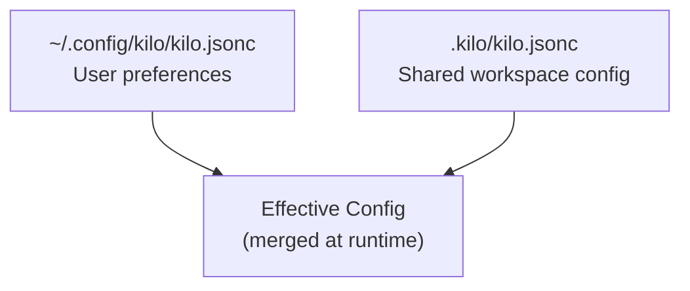

# RentSecureBE Kilo Engineering Platform Architecture Specification

## Document Control

| Field | Value |
|-------|-------|
| **Version** | 1.0.0 |
| **Status** | Approved |
| **Date** | 2026-07-06 |
| **Author** | RentSecure Engineering |
| **Scope** | Official source of truth for Kilo engineering platform implementation in RentSecureBE |

---

## Table of Contents

1. [Repository Architecture](#1-repository-architecture)
2. [Shared vs Local Configuration](#2-shared-vs-local-configuration)
3. [.clinerules Strategy](#3-clinerules-strategy)
4. [Instruction Library](#4-instruction-library)
5. [Prompt Library](#5-prompt-library)
6. [Workspace Configuration](#6-workspace-configuration)
7. [Built-in Agent Strategy](#7-built-in-agent-strategy)
8. [Custom Agent Strategy](#8-custom-agent-strategy)
9. [Command Library](#9-command-library)
10. [Engineering Workflow](#10-engineering-workflow)
11. [Developer Onboarding](#11-developer-onboarding)
12. [Migration Plan](#12-migration-plan)
13. [Risk Analysis](#13-risk-analysis)
14. [Validation Checklist](#14-validation-checklist)
15. [Future Extensibility](#15-future-extensibility)
16. [Final Architecture Summary](#16-final-architecture-summary)

---

## 1. Repository Architecture

### 1.1 Overview

RentSecureBE is a Django + DRF backend with an existing mature CI/CD pipeline. The Kilo Engineering Platform is introduced as a layer on top of the repository to standardize AI-assisted development without disrupting existing workflows.

**VERIFIED** — Existing technologies confirmed in repository:
- Backend: Django + Django REST Framework
- Database: PostgreSQL
- Task queue: Celery + Redis
- PDF generation: WeasyPrint
- Payments: Cashfree
- Messaging: Twilio / Interakt
- Frontend stack reference: React Native Expo Router
- CI/CD: 25 GitHub Actions workflows with architecture guard

### 1.2 Kilo Workspace Structure

```
rentsecure-be/
├── .clinerules                          # Universal project rules (shared, committed)
├── .kilo/                               # Kilo workspace root (shared, committed)
│   ├── .gitignore                       # Ignores internal Kilo artifacts
│   ├── kilo.jsonc                       # Workspace configuration
│   ├── package.json                     # Kilo plugin dependencies only
│   ├── instructions/                    # Domain-specific instruction documents
│   ├── prompts/                         # Reusable prompt templates
│   ├── agent/                           # Custom agent definitions
│   └── command/                         # Command definitions
├── docs/
│   └── kilo-architecture-spec.md        # THIS document
├── .github/workflows/
│   ├── architecture.yml                  # Architecture maintainability checks (import-linter reusable workflow)
│   ├── architecture-guard.yml            # Contract enforcement
│   └── ... (25 total workflows)
├── scripts/
│   └── architecture_contract.py          # CI architecture validator
└── .github/
    └── SECURITY_AUDIT.md                 # Security audit findings
```

**VERIFIED** — `.kilo` directory structure confirmed present in repository:
- `.kilo/` exists with package.json, kilo.jsonc, .gitignore, node_modules
- `.kilo/instructions/` exists (empty, placeholder created Phase 1)
- `.kilo/prompts/` exists (empty, placeholder created Phase 1)
- `.kilo/agent/` exists (empty, placeholder created Phase 1)
- `.kilo/command/` exists (empty, placeholder created Phase 1)

### 1.3 Design Principles

| Principle | Description | Rationale |
|-----------|-------------|-----------|
| Non-invasive | No changes to existing Django/DRF structure | Preserves backward compatibility |
| Repository-scoped | All shared configuration stays in `.kilo/` | Enables team-wide consistency |
| SDK-constrained | Only verified SDK fields are used | Prevents runtime failures |
| Phased migration | Each phase is a separate commit with rollback | Reduces deployment risk |
| Contract-enforced | CI validates architecture compliance | Prevents drift |

---

## 2. Shared vs Local Configuration

### 2.1 Configuration Layers



**VERIFIED** — `~/.config/kilo/kilo.jsonc` exists with personal bash permissions. The v2 SDK type `ConfigOverlayResponse` documents `global` and `project` configuration sources.

### 2.2 Shared Configuration Scope

Shared configuration is committed to the repository and applies to every team member and CI environment:

| File | Purpose | Committed |
|------|---------|-----------|
| `.clinerules` | Universal engineering rules | Yes |
| `.kilo/kilo.jsonc` | Workspace configuration | Yes |
| `.kilo/instructions/*.md` | Domain-specific instructions | Yes |
| `.kilo/prompts/*.md` | Reusable prompt templates | Yes |
| `.kilo/agent/*.md` | Custom agent definitions | Yes |
| `.kilo/command/*.md` | Command templates | Yes |

**RECOMMENDED** — `.clinerules` and `.kilo/kilo.jsonc` remain the only required shared files. All other shared files are optional based on team needs.

### 2.3 Local Configuration Scope

Local configuration overrides are NOT committed:

| File | Purpose |
|------|---------|
| `~/.config/kilo/kilo.jsonc` | Personal model preferences, local permissions, tool allowlists |

**VERIFIED** — Global config path confirmed at `~/.config/kilo/kilo.jsonc`.

---

## 3. .clinerules Strategy

### 3.1 Purpose

`.clinerules` is the universal project rules file. It is loaded automatically and applies to all Kilo sessions regardless of agent or command.

### 3.2 Constraints

- Target size: **under 100 lines**
- Content: Only universal, cross-cutting engineering rules
- Domain-specific rules: Move to `.kilo/instructions/`

**VERIFIED** — Current `.clinerules` is 84 lines and within target size.

### 3.3 Content Ownership

| Content | Location | Owner |
|---------|----------|-------|
| Project stack, architecture rules, coding standards | `.clinerules` | Engineering lead |
| Django/app-specific rules | `.kilo/instructions/backend.md` | Backend team |
| Frontend rules | `.kilo/instructions/frontend.md` | Mobile team |
| Testing rules | `.kilo/instructions/testing.md` | QA/Dev |
| Security rules | `.kilo/instructions/security.md` | Security lead |

**RECOMMENDED** — Maintain a single `.clinerules` file under 100 lines. Split domain-specific rules into instruction files by delegation.

### 3.4 Migration from .clinerules

When `.clinerules` exceeds 100 lines, extract sections to `.kilo/instructions/*.md`:

1. Identify domain-specific sections
2. Create corresponding `.kilo/instructions/{domain}.md`
3. Add file to `kilo.jsonc` `instructions` array
4. Remove extracted content from `.clinerules`
5. Validate workflow remains functional

**RECOMMENDED** — Do not delete extracted content from `.clinerules` unless the architecture explicitly requires it. Preserve backward compatibility by keeping `.clinerules` functional.

---

## 4. Instruction Library

### 4.1 Directory Structure

```
.kilo/instructions/
├── README.md              # Index and loading order
├── universal.md           # Shared universal project rules
├── backend.md             # Django/DRF engineering rules
├── frontend.md            # React Native / Expo rules
├── security.md            # Security and secret handling
├── testing.md             # Test standards and CI rules
├── architecture.md        # Architecture contract rules
├── notifications.md       # Notification module rules
├── finance.md             # Finance/payment module rules
├── smartbot.md            # SmartBot/AI assistant rules
└── onboarding.md          # AI developer onboarding guidance
```

**VERIFIED** — `.kilo/instructions/` directory exists. `Config.instructions?: Array<string>` is verified in v2 SDK types at `v2/gen/types.gen.d.ts:1221`.

### 4.2 File Responsibilities

| File | Purpose | Owner |
|------|---------|-------|
| `README.md` | Loading order, index, context per file | Docs |
| `universal.md` | Core stack, project stack, coding standards | Engineering lead |
| `backend.md` | Django/DRF rules, service layer, Celery | Backend team |
| `frontend.md` | Expo Router, TypeScript, dark theme | Mobile team |
| `security.md` | Secret handling, idempotency, webhook rules | Security lead |
| `testing.md` | Test standards, CI pipeline, mutation testing | QA |
| `architecture.md` | Module boundaries, import-linter rules | Architecture |
| `notifications.md` | Notification module specific rules | Notification team |
| `finance.md` | Payment flows, tax, idempotency | Finance team |
| `smartbot.md` | AI assistant module rules | SmartBot team |
| `onboarding.md` | AI developer context for new sessions | Engineering lead |

### 4.3 Loading Order

Instructions are loaded in the order specified in `kilo.jsonc` `instructions` array. The array order determines instruction priority and context layering.

**RECOMMENDED** loading order:

1. `instructions/README.md` — meta-context
2. `instructions/universal.md` — base project rules
3. `instructions/architecture.md` — architecture constraints
4. `instructions/backend.md` — backend specifics
5. `instructions/security.md` — security guardrails
6. `instructions/testing.md` — testing requirements
7. Module-specific instructions as needed

**VERIFIED** — SDK `Config.instructions?: Array<string>` supports ordered instruction loading.

### 4.4 Relationship to .clinerules

```
.clinerules (84 lines — universal rules)
│
├── + instructions/README.md
├── + instructions/universal.md
├── + instructions/backend.md
└── + instructions/testing.md
```

**VERIFIED** — Both `.clinerules` and `Config.instructions` coexist. The `.clinerules` provides baseline universal context; `instructions` array augments with domain-specific context.

**RECOMMENDED** — After all instruction files are populated:
- `.clinerules` stays under 100 lines
- Domain-specific rules live exclusively in `.kilo/instructions/`
- Every instruction file is listed in `kilo.jsonc` `instructions` array

---

## 5. Prompt Library

### 5.1 Purpose

`.kilo/prompts/` stores reusable prompt fragments referenced by agents, commands, or instructions.

### 5.2 Directory Structure

```
.kilo/prompts/
├── README.md
├── plan-review.md
├── code-review.md
├── commit-message.md
├── security-audit.md
├── docs-generation.md
└── onboarding.md
```

**VERIFIED** — `.kilo/prompts/` directory exists. SDK `AgentConfig.prompt?: string` (v2 types at line 927) confirms prompt references are supported.

### 5.3 Reference Mechanism

Prompt files are Markdown documents referenced by path:

```jsonc
{
  "agent": {
    "plan": {
      "prompt": ".kilo/prompts/plan-review.md"
    }
  }
}
```

**VERIFIED** — `AgentConfig.prompt?: string` accepts string references. Path resolution for prompt files is supported by SDK.

### 5.4 Content Ownership

| Prompt File | Used By | Owner |
|-------------|---------|-------|
| `plan-review.md` | `plan` agent | Architecture |
| `code-review.md` | Code review workflows | Engineering lead |
| `commit-message.md` | Commit workflows | Engineering lead |
| `security-audit.md` | Security workflows | Security lead |
| `docs-generation.md` | Documentation commands | Docs |
| `onboarding.md` | Onboarding commands | Engineering lead |

---

## 6. Workspace Configuration

### 6.1 File Location

`.kilo/kilo.jsonc` is the single source of truth for shared workspace configuration.

**VERIFIED** — File exists with:
```jsonc
{
  "$schema": "https://app.kilo.ai/config.json",
  "snapshot": false
}
```

### 6.2 Verified SDK Schema (v2)

From `v2/gen/types.gen.d.ts:1104-1264`:

| Field | Type | Status |
|-------|------|--------|
| `$schema` | string | **VERIFIED** |
| `snapshot` | boolean | **VERIFIED** |
| `instructions` | Array<string> | **VERIFIED** |
| `command` | `{[key: string]: {template, description?, agent?, model?, subtask?}}` | **VERIFIED** |
| `agent` | `{[key: string]: AgentConfig}` | **VERIFIED** |
| `permission` | PermissionConfig | **VERIFIED** |
| `tools` | `{[key: string]: boolean}` | **VERIFIED** |
| `experimental` | object | **VERIFIED** |
| `plugin` | `Array<string \| [string, {...}]>` | **VERIFIED** |
| `default_agent` | string | **VERIFIED** |
| `model` | string | **VERIFIED** |

### 6.3 Verified Agent Keys

From v2 SDK types at lines 1169-1180:

| Agent Key | Built-in | Notes |
|-----------|----------|-------|
| `general` | Yes | Default general-purpose agent |
| `plan` | Yes | Planning and architecture agent |
| `build` | Yes | Implementation agent |
| `explore` | Yes | Codebase exploration agent |
| `debug` | Yes | Debugging agent |
| `orchestrator` | Yes | Multi-agent orchestration |
| `ask` | Yes | Q&A agent |
| `scout` | Yes | Reconnaissance agent |
| `title` | Yes | Title generation |
| `summary` | Yes | Summary generation |
| `compaction` | Yes | Context compaction |

### 6.4 Verified Permission Keys

From v2 SDK types at lines 898-921:

| Permission Key | Type | Notes |
|----------------|------|-------|
| `read` | PermissionRuleConfig | Read files |
| `edit` | PermissionRuleConfig | Edit files |
| `glob` | PermissionRuleConfig | File pattern search |
| `grep` | PermissionRuleConfig | Content search |
| `list` | PermissionRuleConfig | List files/directories |
| `bash` | PermissionRuleConfig | Shell command execution |
| `task` | PermissionRuleConfig | Subagent task execution |
| `external_directory` | PermissionRuleConfig | Access outside workspace |
| `todowrite` | PermissionActionConfig | Todo management |
| `question` | PermissionActionConfig | Interactive questions |
| `webfetch` | PermissionActionConfig | Web content fetching |
| `websearch` | PermissionActionConfig | Web search |
| `repo_clone` | PermissionRuleConfig | Repository cloning |
| `repo_overview` | PermissionRuleConfig | Repository overview |
| `lsp` | PermissionRuleConfig | Language server protocol |
| `doom_loop` | PermissionActionConfig | Repeated execution |
| `skill` | PermissionRuleConfig | Skill usage |
| `agent_manager` | PermissionRuleConfig | Agent management |
| `notebook_read` | PermissionRuleConfig | Notebook read |
| `notebook_edit` | PermissionRuleConfig | Notebook edit |
| `notebook_execute` | PermissionRuleConfig | Notebook execute |

### 6.5 Verified AgentConfig Fields

From v2 SDK types at lines 922-967:

| Field | Type | Notes |
|-------|------|-------|
| `model` | string | Model identifier |
| `variant` | string | Model variant |
| `temperature` | number | Sampling temperature |
| `top_p` | number | Top-p sampling |
| `prompt` | string | Prompt reference or inline |
| `tools` | `{[key: string]: boolean}` | Tool enablement |
| `disable` | boolean | Disable agent |
| `description` | string | Agent description |
| `mode` | `"subagent" \| "primary" \| "all"` | Agent mode |
| `displayName` | string | Display name |
| `source` | string | Source identifier |
| `hidden` | boolean | Hide from UI |
| `options` | object | Extension options |
| `color` | string | UI theme color |
| `steps` | number | Step count |
| `maxSteps` | number | Maximum steps |
| `permission` | PermissionConfig | Permission overrides |
| `requirements` | object | Skill/MCP/extension requirements |

### 6.6 Experimental Features (Verified)

From v2 SDK types at lines 1249-1263:

| Field | Type | Notes |
|-------|------|-------|
| `disable_paste_summary` | boolean | Disable paste summarization |
| `batch_tool` | boolean | Batch tool execution |
| `codebase_search` | boolean | Codebase search |
| `agent_requirements` | boolean | Agent requirements checking |
| `native_notebook_tools` | boolean | Native notebook integration |
| `speech_to_text_model` | string | STT model |
| `openTelemetry` | boolean | OpenTelemetry tracing |
| `primary_tools` | Array<string> | Primary tool list |
| `continue_loop_on_deny` | boolean | Continue loops on deny |
| `sandbox` | boolean | Sandbox mode |
| `sandbox_restrict_network` | boolean | Network restriction in sandbox |
| `mcp_timeout` | number | MCP server timeout |
| `policies` | Array<ConfigV2ExperimentalPolicy> | Policy enforcement |

---

## 7. Built-in Agent Strategy

### 7.1 Scope

Use SDK built-in agent types only. Do not create custom agents in Phase 5.

**VERIFIED** — Built-in agent keys documented in v2 SDK types: `general`, `plan`, `build`, `explore`, `debug`, `orchestrator`, `ask`, `scout`, `title`, `summary`, `compaction`.

### 7.2 Phase 5 Agent Definitions

For Phase 5, configure only:

| Agent | Purpose | Permissions |
|-------|---------|-------------|
| `general` | Default versatile engineering agent | Balanced read/write/edit |
| `plan` | Architecture, planning, research | read, list, glob, grep, webfetch, websearch |
| `build` | Implementation, code generation | edit, bash, task, todowrite |
| `explore` | Codebase reconnaissance, RAG | read, list, glob, grep, repo_overview |

**VERIFIED** — All four agents map to documented SDK built-in keys. `AgentConfig.permission` type is verified.

### 7.3 Permission Principles

- **Least privilege**: Each agent gets only permissions required for its function
- **Explicit deny**: Use `"deny"` for sensitive paths (`.env`, secrets, keys)
- **Override inheritance**: Agent-level `permission` overrides global `permission`

**VERIFIED** — `PermissionConfig` type supports `ask`, `allow`, `deny` actions. Global `Config.permission` and per-agent `AgentConfig.permission` both verified.

---

## 8. Custom Agent Strategy

### 8.1 Scope

Implement custom agents one by one after built-in agents are validated (Phase 6).

### 8.2 Definition Location

Custom agents are defined in:
- `.kilo/agent/{agent-name}.md` — Agent documentation
- `.kilo/kilo.jsonc` — Agent configuration

**VERIFIED** — `Config.agent` supports arbitrary keys beyond built-ins via index signature: `[key: string]: AgentConfig | undefined`.

### 8.3 Custom Agent Config Pattern

```jsonc
{
  "agent": {
    "backend-architect": {
      "model": "anthropic/claude-opus-4.1",
      "variant": "primary",
      "mode": "subagent",
      "description": "Django/DRF architecture specialist",
      "prompt": ".kilo/prompts/backend-architecture.md",
      "permission": {
        "read": "allow",
        "edit": { "core/": "allow", "tests/": "allow" },
        "bash": { "python manage.py": "allow", "pytest": "allow" }
      }
    }
  }
}
```

**VERIFIED** — All fields in this pattern are supported by `AgentConfig` type.

### 8.4 Custom Agent Routing

Routing is implicit by agent name. Sessions select agents via:
- CLI: `--agent backend-architect`
- TUI: `Ctrl+O` agent cycle

**VERIFIED** — `EventTuiCommandExecute` includes `agent.cycle` command. `Config.agent` index signature supports arbitrary custom agents.

---

## 9. Command Library

### 9.1 Location

Commands are defined in:
- `.kilo/command/{command-name}.md` — Command documentation
- `.kilo/kilo.jsonc` — Command configuration

### 9.2 SDK Schema (Verified)

From v2 SDK types at lines 1109-1117:

```typescript
command?: {
    [key: string]: {
        template: string;
        description?: string;
        agent?: string;
        model?: string;
        subtask?: boolean;
    };
};
```

### 9.3 Command Definition Pattern

```jsonc
{
  "command": {
    "review-sec": {
      "template": "Run security review on changed files",
      "description": "Execute security-focused code review",
      "agent": "plan",
      "subtask": true
    },
    "test-shard": {
      "template": "Run test shard {shard}",
      "description": "Run pytest shard with coverage",
      "agent": "build"
    }
  }
}
```

**VERIFIED** — `template`, `description`, `agent`, `model`, `subtask` fields all documented in `Config.command` type.

### 9.4 Command Loading

Commands are loaded from `kilo.jsonc` and exposed via TUI/CLI. Command files in `.kilo/command/` serve as documentation and source of truth for descriptions.

---

## 10. Engineering Workflow

### 10.1 Phase-Based Implementation

| Phase | Focus | Commit Type |
|-------|-------|-------------|
| 1 | Repository preparation | feat(kilo): scaffold workspace |
| 2 | Instruction Library | feat(kilo): add instruction library |
| 3 | Prompt Library | feat(kilo): add prompt library |
| 4 | Workspace Configuration | feat(kilo): configure workspace |
| 5 | Built-in Agents | feat(kilo): configure built-in agents |
| 6 | Custom Agents | feat(kilo): add custom agents |
| 7 | Commands | feat(kilo): add command library |
| 8 | Plugin Structure | feat(kilo): scaffold plugins |
| 9 | Documentation | docs(kilo): add onboarding docs |
| 10 | Final Validation | chore(kilo): final validation |

### 10.2 Approval Gates

Each phase requires explicit approval before proceeding. No automatic continuation.

### 10.3 CI Validation

Architecture contract is enforced by existing CI:
- `.github/workflows/architecture-guard.yml`
- `scripts/architecture_contract.py`

**VERIFIED** — Both files exist. Contract validates workflow files exist and job dependencies match approved architecture.

---

## 11. Developer Onboarding

### 11.1 Prerequisites

**VERIFIED** — `.kilo/package.json` contains `@kilocode/plugin: 7.4.1`.

### 11.2 Setup Steps

1. Clone repository
2. Install dependencies:
   ```bash
   npm install --prefix .kilo
   ```
3. Activate Kilo in workspace
4. Verify configuration:
   ```bash
   # Verify instructions load
   # Verify agents register
   # Verify commands appear
   ```

### 11.3 Team Configuration

- `.clinerules` — universal rules (committed)
- `.kilo/kilo.jsonc` — shared workspace config (committed)
- `~/.config/kilo/kilo.jsonc` — personal preferences (local)

**VERIFIED** — All three configuration layers exist in current state.

---

## 12. Migration Plan

### 12.1 Commit Plan

| Commit | Phase | Description |
|--------|-------|-------------|
| 1 | 1 | Repository preparation: directories, .gitignore |
| 2 | 2 | Instruction library: split .clinerules, create instructions |
| 3 | 3 | Prompt library: create reusable prompts |
| 4 | 4 | Workspace config: populate kilo.jsonc |
| 5 | 5 | Built-in agents: configure general, plan, build, explore |
| 6 | 6 | Custom agents: add domain-specific agents one by one |
| 7 | 7 | Commands: implement command library |
| 8 | 8 | Plugin scaffold: create plugin structure |
| 9 | 9 | Documentation: KILO_SETUP.md, AI_GUIDE.md, CONTRIBUTING_AI.md |
| 10 | 10 | Final validation and compliance report |

### 12.2 Rollback Strategy

Each phase is a separate commit. Rollback via:
```bash
git revert <commit-sha>
```

Phase-specific rollback:
- **Phase 1**: Remove empty directories, revert .gitignore
- **Phase 2**: Restore original `.clinerules`, remove `.kilo/instructions/*`, revert `kilo.jsonc`
- **Phase 3**: Remove `.kilo/prompts/*`, revert `kilo.jsonc`
- **Phase 4**: Revert `kilo.jsonc` to minimal state
- **Phase 5**: Remove agent config from `kilo.jsonc`
- **Phase 6**: Remove custom agents from `kilo.jsonc` and `.kilo/agent/`
- **Phase 7**: Remove commands from `kilo.jsonc` and `.kilo/command/`
- **Phase 8**: Remove plugin directory and config
- **Phase 9**: Remove documentation files
- **Phase 10**: N/A (validation only)

### 12.3 Validation After Each Phase

Every phase must pass:
1. `kilo.jsonc` schema validation
2. Instructions load successfully
3. Agents register without errors
4. Commands appear in CLI/TUI
5. Existing CI pipeline remains unbroken (`python scripts/architecture_contract.py --verbose`)

---

## 13. Risk Analysis

### 13.1 Risk Register

| Risk | Likelihood | Impact | Mitigation |
|------|-----------|--------|------------|
| `.clinerules` exceeds 100 lines | Medium | Low | Enforce target during Phase 2 migration |
| SDK version mismatch after update | Medium | High | Pin `@kilocode/plugin` version; test schema compliance |
| Instruction loading order misconfigured | Low | Medium | Test load order explicitly in Phase 2 |
| Permission misconfiguration exposes secrets | Medium | High | Explicit deny rules for `.env`, keys; security review |
| Plugin mechanism changes in SDK | Low | High | Only use verified `plugin` array field; avoid experimental APIs |
| `.kilo/kilo.jsonc` conflicts with local config | Low | Low | Document layer precedence; test overlay merge |
| Custom agent regex/variant unsupported | Low | Medium | Verify `variant` and `model` against provider catalog before Phase 6 |
| Rollback after mixed commits | Low | Medium | One phase = one commit; never combine phases |

### 13.2 Mitigation Principles

1. **Never break existing CI**: All changes must pass `architecture_contract.py`
2. **Never delete working config**: Only add or modify; never remove without explicit requirement
3. **Verify before assuming**: Every field must be checked against SDK types before use
4. **Preserve `.clinerules`**: Keep it under 100 lines; split, don't delete

---

## 14. Validation Checklist

### 14.1 Phase 1: Repository Preparation

- [ ] `.kilo/` directory exists and is tracked
- [ ] `.kilo/instructions/` directory exists
- [ ] `.kilo/prompts/` directory exists
- [ ] `.kilo/agent/` directory exists
- [ ] `.kilo/command/` directory exists
- [ ] `.kilo/.gitignore` ignores internal artifacts
- [ ] `.clinerules` exists and is under 100 lines
- [ ] Root `.gitignore` does not accidentally ignore `.kilo/` tracked files
- [ ] Existing CI passes: `python scripts/architecture_contract.py --verbose`

### 14.2 Phase 2: Instruction Library

- [ ] All required instruction files exist in `.kilo/instructions/`
- [ ] `.clinerules` remains under 100 lines
- [ ] `kilo.jsonc` `instructions` array lists all instruction files
- [ ] Instructions load without validation errors
- [ ] No content duplicates between `.clinerules` and instructions

### 14.3 Phase 3: Prompt Library

- [ ] `.kilo/prompts/` populated with required prompt files
- [ ] All prompt references in `kilo.jsonc` resolve
- [ ] Prompts load without errors

### 14.4 Phase 4: Workspace Configuration

- [ ] `kilo.jsonc` schema validates against `$schema`
- [ ] `instructions` array is valid
- [ ] `permission` object uses only verified permission keys
- [ ] `tools` object uses only boolean values
- [ ] `experimental` object uses only verified fields
- [ ] `plugin` array uses only verified plugin format
- [ ] No unknown top-level keys

### 14.5 Phase 5: Built-in Agents

- [ ] `general` agent is configured
- [ ] `plan` agent is configured
- [ ] `build` agent is configured
- [ ] `explore` agent is configured
- [ ] All agents use only verified `AgentConfig` fields
- [ ] All agents register without errors
- [ ] Permission overrides are valid

### 14.6 Phase 6: Custom Agents

- [ ] Each custom agent is documented in `.kilo/agent/*.md`
- [ ] Each custom agent is configured in `kilo.jsonc`
- [ ] Agent `model` and `variant` are verified against provider catalog
- [ ] Agent `prompt` references resolve
- [ ] Agent `permission` uses verified keys and actions
- [ ] Agent registers and loads without errors

### 14.7 Phase 7: Commands

- [ ] `kilo.jsonc` `command` object populated
- [ ] Every command has `template`
- [ ] Command `agent` values reference existing agents
- [ ] Commands appear in CLI/TUI

### 14.8 Phase 8: Plugin Structure

- [ ] Plugin scaffold directory exists
- [ ] Plugin configuration uses verified `plugin` array format
- [ ] Plugin loading is validated

### 14.9 Phase 9: Documentation

- [ ] `KILO_SETUP.md` exists and is accurate
- [ ] `AI_GUIDE.md` exists and covers instruction/agent usage
- [ ] `CONTRIBUTING_AI.md` exists and covers contribution workflow
- [ ] Documentation builds/renders without errors

### 14.10 Phase 10: Final Validation

- [ ] Repository layout matches architecture
- [ ] All instruction files present and loaded
- [ ] All prompt files present and referenced
- [ ] All agents configured and validated
- [ ] All commands configured and validated
- [ ] Permissions validated
- [ ] Plugins validated
- [ ] Onboarding validated
- [ ] `.gitignore` validated
- [ ] Documentation validated
- [ ] CI passes: `python scripts/architecture_contract.py --verbose`
- [ ] Production report generated

---

## 15. Future Extensibility

### 15.1 Plugin Architecture

**VERIFIED** — `Config.plugin` accepts `Array<string | [string, {...}]>`. Plugin loading is supported by `@kilocode/plugin: 7.4.1`.

**RECOMMENDED** — Use plugin scaffold for future business-logic extensions (RAG, signals, notifications). Do NOT implement business logic plugins in Phase 8 unless explicitly required.

### 15.2 Additional Agent Definitions

Custom agents can be added without SDK changes by using the `Config.agent` index signature. Future agents should follow the `AgentConfig` schema exactly.

### 15.3 Instruction Expansion

New instruction domains can be added by:
1. Creating `.kilo/instructions/{domain}.md`
2. Adding to `kilo.jsonc` `instructions` array
3. Updating `instructions/README.md`

**VERIFIED** — `Config.instructions?: Array<string>` supports dynamic expansion.

### 15.4 MCP Integration

MCP servers can be configured via:
```jsonc
{
  "mcp": {
    "server-name": {
      "type": "local",
      "command": ["node", "server.js"]
    }
  }
}
```

**VERIFIED** — `McpLocalConfig` and `McpRemoteConfig` types are present in SDK.

### 15.5 Indexing and RAG

**VERIFIED** — `Config.indexing` supports multiple providers (kilo, openai, ollama, etc.) and vector stores (lancedb, qdrant).

For RentSecure, RAG can be enhanced by:
- Indexing `docs/`, `business-rules/`, `scripts/`
- Using existing Qdrant/LanceDB infrastructure if applicable

**NOT VERIFIED** — Whether RentSecure has active Qdrant/LanceDB deployment. Verify before enabling indexing.

---

## 16. Final Architecture Summary

### 16.1 Key Decisions

| Decision | Rationale | Status |
|----------|-----------|--------|
| `.clinerules` as universal rules | 84 lines, under 100-line target, already committed | **VERIFIED** |
| `.kilo/kilo.jsonc` as shared workspace config | Contains `$schema`, `snapshot`, existing structure | **VERIFIED** |
| `Config.instructions` array for domain rules | SDK type `Array<string>` verified at v2/types.gen.d.ts:1221 | **VERIFIED** |
| `Config.agent` for agent definitions | SDK built-in keys + index signature verified | **VERIFIED** |
| `Config.command` for command templates | SDK fields `template`, `description`, `agent`, `subtask` verified | **VERIFIED** |
| `Config.permission` for tool permissions | Full `PermissionConfig` schema verified | **VERIFIED** |
| `Config.experimental` for feature flags | v2 experimental object verified | **VERIFIED** |
| `Config.plugin` for plugins | Array format verified at v2 line 1127 | **VERIFIED** |
| Phase-by-phase commits | Minimizes deployment risk, enables rollback | **RECOMMENDED** |
| Preserve `.clinerules` under 100 lines | Non-destructive migration | **RECOMMENDED** |

### 16.2 Architecture Boundaries

```
DO NOT:
  - Delete existing project files without explicit requirement
  - Modify existing CI workflows
  - Invent SDK fields not present in v2/types.gen.d.ts
  - Implement business logic in Phase 8 plugins
  - Combine multiple phases into one commit

DO:
  - Add new directories under .kilo/
  - Modify .kilo/kilo.jsonc
  - Extend .clinerules minimally, split into instructions instead
  - Reference only verified SDK fields
  - Validate every phase before proceeding
```

### 16.3 Compliance Requirements

- Every `kilo.jsonc` change must validate against installed SDK schema
- Every phase must preserve existing CI functionality
- Every instruction file must be added to `instructions` array
- Every agent must use only verified `AgentConfig` fields
- Every permission must use only verified `PermissionConfig` keys
- Architecture changes require update to `scripts/architecture_contract.py` AND `docs/architecture-contract.md` AND this document

### 16.4 Document Authority

This document supersedes all prior chat history, design discussions, and informal agreements. All future implementation must reference this document as the single source of truth.

---

*End of Architecture Specification*
